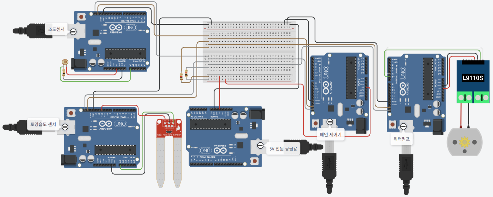
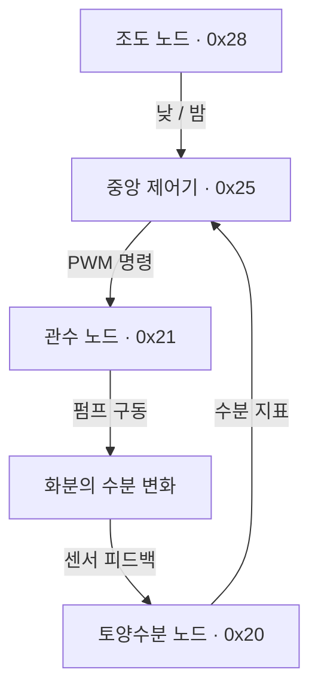
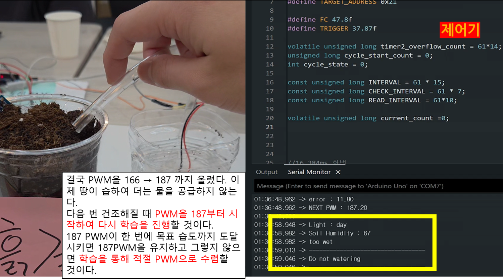

# Smart Farming Beyond the Greenhouse

**온실을 나온 스마트팜 · 토양수분 피드백으로 관수량을 조절하는 분산형 임베디드 시스템**

화분의 토양수분과 주변 밝기를 측정해 급수 시점을 결정하고, 물을 준 뒤의 수분 변화에 따라 다음 펌프 출력을 조절합니다. Arduino Uno 4대를 센싱·판단·구동 노드로 나누고, **멀티 마스터 I²C 통신과 ATmega328P 레지스터 제어**로 연결했습니다.

| 프로젝트 | 내용 |
|---|---|
| 수행 시기 | 25년 2분기 |
| 하드웨어 | Arduino Uno × 4, CdS 조도센서, Grove 토양수분센서, L9110S, DC 워터펌프 |
| 펌웨어 | C/C++, TWI, ADC, Timer2 인터럽트, Timer0 PWM, UART |
| 김우석 담당 | 프로젝트 개요·제어 흐름 설계, TWI 통신 로직 |

[설계와 구현](docs/design.md) · [시연 결과](docs/demo.md) · [배선·실행 방법](docs/setup.md) · [코드 정리 내역](docs/code-notes.md)

## 구현 목표

같은 시간 동안 펌프를 구동해도 흙의 양과 수분 상태에 따라 급수 결과가 달라집니다. 이 프로젝트는 **물을 줄 조건을 판단하는 과정**과 **급수 후 결과로 다음 출력을 보정하는 과정**을 연결했습니다.

- 낮이고 토양수분이 설정 기준 이하이면 펌프를 구동합니다.
- 야간이거나 토양수분이 기준보다 높으면 새 관수를 시작하지 않습니다.
- 관수 후 수분이 목표보다 낮으면 다음 PWM을 높이고, 목표보다 높으면 낮춥니다.

## 시스템 구성





| 노드 | 역할 | 구현 포인트 |
|---|---|---|
| [조도](firmware/light_node/light_node.ino) | A0에서 밝기를 읽어 낮·밤 전송 | ADC 임계값과 밝기 변화량을 함께 반영 |
| [토양수분](firmware/soil_node/soil_node.ino) | A0 측정값을 수분 지표로 변환·전송 | ADC 직접 제어, 센서값 정규화 |
| [중앙 제어기](firmware/controller/controller.ino) | 관수 판단 및 다음 PWM 계산 | 센서 수신과 펌프 명령 송신을 한 TWI 인터페이스에서 수행 |
| [관수](firmware/pump_node/pump_node.ino) | 수신한 PWM으로 약 3초간 급수 | Timer0 PWM 출력, Timer2 인터럽트로 구동 종료 |

## 핵심 설계

### 송신할 때 마스터가 되는 I²C 노드

센서 노드는 측정값을 보낼 때 버스 마스터로 동작합니다. 중앙 제어기는 센서값을 받을 때 슬레이브, 펌프 명령을 보낼 때 마스터로 전환합니다. 네 노드는 SDA·SCL과 공통 GND를 공유합니다.

수신 노드가 데이터의 출처를 식별하도록 **`[송신 노드 ID, 값]`의 2바이트 페이로드**를 정의했습니다. 목적지 주소는 I²C 주소 단계에서 전달하고, 페이로드의 첫 바이트로 센서 종류와 명령 발신자를 판별합니다.

### 시간 순서가 있는 관수 제어

Timer2 오버플로우를 기준으로 센서 전송, 관수 판단, 급수 후 보정을 배치했습니다. 시연 설정은 센서 전송 약 3초, 관수 판단 약 15초, 관수 시작 후 보정 약 5초입니다. 펌프 노드는 명령을 받으면 약 3초간 동작하고 자체 타이머로 정지합니다.

### 수분 오차에 따른 PWM 갱신

관수 후 수분 지표를 목표값과 비교해 다음 PWM을 계산합니다.

```text
error    = target - moisture
gain     = 0.40  (목표보다 건조할 때)
           0.80  (목표보다 습할 때)
next_pwm = clamp(pwm + gain × error, 0, 254)
```

초기 PWM은 150입니다. 과다 급수 뒤에는 더 큰 이득으로 출력을 낮추도록 설정했습니다. 시연에 사용한 수분 지표의 목표값은 47.8, 관수 시작 기준은 37.87입니다. [수분 지표와 기준값의 정의](docs/design.md#수분-지표와-기준값)에서 센서 변환식과 설정 근거를 설명합니다.

## 시연 결과

실제 흙·물탱크·워터펌프를 연결하고, 시리얼 로그와 동작 영상을 함께 기록했습니다.

| 조건 | 관찰한 동작 |
|---|---|
| 낮 + 건조한 흙 | PWM 명령 전송 후 펌프 구동 |
| 수분이 높은 흙으로 센서 이동 | 수분 지표 87에서 다음 관수 차단 |
| 조도센서 가림·해제 | 야간에는 관수 차단, 주간·건조 조건에서 재개 |
| 흙의 양에 비해 관수량이 많음 | 음의 오차를 반영해 다음 PWM 감소 |
| 흙의 양에 비해 관수량이 적음 | 양의 오차를 반영해 다음 PWM 증가 |



[5가지 시연의 조건·사진·영상 보기](docs/demo.md)

## 담당 업무와 문제 해결

김우석은 개요와 제어 흐름을 구성하고 TWI 통신 로직을 작성했습니다. 센서·관수부를 나누어 개발한 뒤 공통 버스로 통합했습니다.

- **여러 송신자의 구분:** 페이로드에 송신 노드 ID를 넣고 수신 상태에 따라 ID와 데이터를 나누어 처리했습니다.
- **통신 상태 처리:** TWI 상태 레지스터에서 ACK·NACK와 중재 상실을 판별해 전송 결과를 처리했습니다.
- **관수와 보정의 순서 관리:** 하나의 Timer2를 이용해 관수 판단과 후속 PWM 갱신을 분리하고, 플래그로 한 주기 내 중복 보정을 제어했습니다.

## 코드와 자료

| 경로 | 내용 |
|---|---|
| [`firmware/`](firmware) | 4개 노드의 Arduino 스케치 |
| [`docs/`](docs) | 구조, 프로토콜, 제어식, 배선, 시연, 코드 변경 내역 |
| [`assets/`](assets) | 회로도, 실제 장치 사진, 시연 화면 |
| [`archive/`](archive) | 별도 파일로 남아 있던 초기 TWI 송신 스케치 |
| [`tools/build.py`](tools/build.py) · [`tests/`](tests) | AVR 빌드 및 제어식·타이머 경계값 검사 |

Arduino IDE에서 각 노드의 `.ino`를 열고 **Arduino Uno**에 업로드합니다. 네 보드의 주소와 배선은 [설치 안내](docs/setup.md)에 정리했습니다.

팀장: 김우석(전체 아키텍처 및 동작 설계, 문서 및 산출물 관리, 전체 디버깅&안정화) · 김주성 · 김지현 · 류대선 · 문기윤
