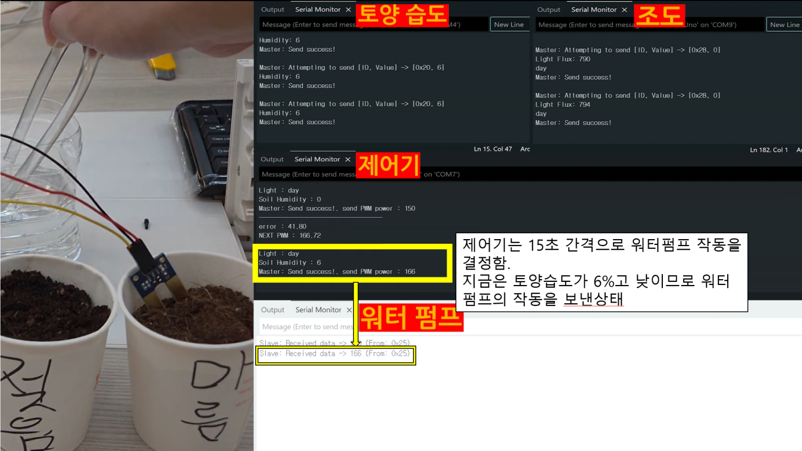
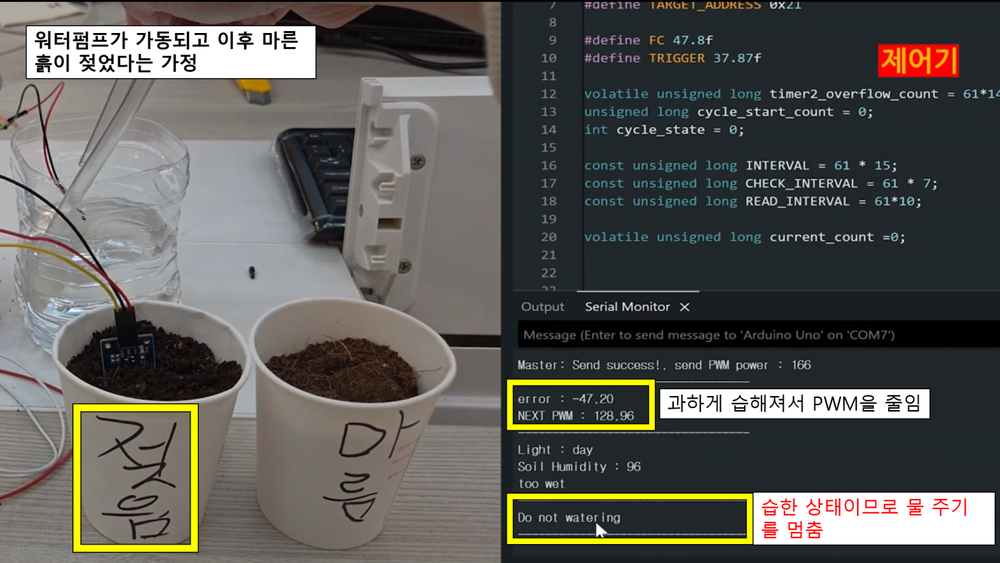
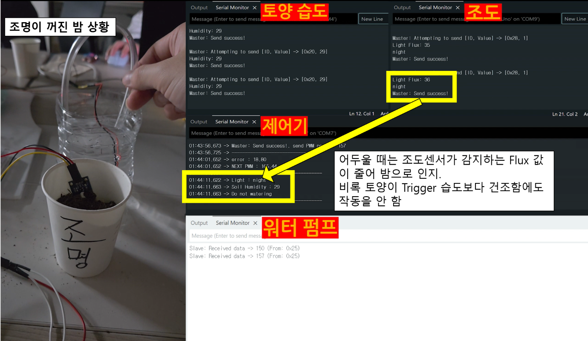
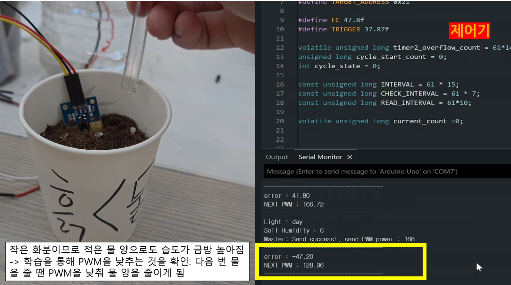

# 시연 결과

실제 흙, 물탱크, DC 워터펌프를 연결하고 센서·제어기·관수 노드의 시리얼 로그를 함께 기록했습니다. 아래 화면과 영상에서 다섯 가지 조건의 동작을 볼 수 있습니다.

## 1. 주간·건조 조건에서 관수

센서를 마른 흙에 꽂고 호스를 화분 밖으로 두어 건조 상태를 유지했습니다. 중앙 제어기가 주간과 건조 조건을 확인한 뒤 PWM을 전송하고, 관수 노드가 펌프를 구동했습니다. 관수 후에도 수분 지표가 낮으면 다음 PWM이 증가했습니다.

[시연 영상 1](https://github.com/kingwooseok/Smart-Farming-Beyond-the-Greenhouse/releases/download/project-demo/01-dry-soil.mp4)

## 2. 수분이 높은 흙에서 관수 차단

센서를 마른 흙에서 습한 흙으로 옮겼습니다. 수분 지표가 87로 올라간 뒤 다음 관수 판단에서 PWM 명령 전송이 중단되었습니다.

[시연 영상 2](https://github.com/kingwooseok/Smart-Farming-Beyond-the-Greenhouse/releases/download/project-demo/02-wet-soil.mp4)

## 3. 조도에 따른 관수 차단·재개

토양수분 조건을 유지한 채 조도센서를 가려 야간 상태를 만들었습니다. 야간에서는 새 관수를 시작하지 않았으며, 밝기를 회복하면 주간·건조 조건에 따라 관수가 재개되었습니다.

[시연 영상 3](https://github.com/kingwooseok/Smart-Farming-Beyond-the-Greenhouse/releases/download/project-demo/03-night-block.mp4)

## 4. 관수량이 많을 때 PWM 감소

적은 양의 흙에 급수해 관수 후 지표가 목표값보다 높아지는 조건을 만들었습니다. 제어기는 음의 오차를 계산하고 다음 PWM을 낮췄습니다. 수분 지표가 관수 시작 기준보다 높은 동안에는 새 명령을 보내지 않았습니다.

[시연 영상 4](https://github.com/kingwooseok/Smart-Farming-Beyond-the-Greenhouse/releases/download/project-demo/04-decrease-pwm.mp4)

## 5. 관수량이 적을 때 PWM 증가

흙의 양을 늘려 한 번의 관수로 목표값에 도달하지 못하는 조건을 만들었습니다. 관수 후 양의 오차를 반영하면서 다음 PWM이 증가했습니다. 반복 관수 중 PWM이 164, 174, 182로 올라가는 장면을 기록했습니다.

[시연 영상 5](https://github.com/kingwooseok/Smart-Farming-Beyond-the-Greenhouse/releases/download/project-demo/05-increase-pwm.mp4)

회로 구성과 제어 방식은 [설계와 구현](design.md), 장치 연결은 [배선과 실행](setup.md)에 정리했습니다.
