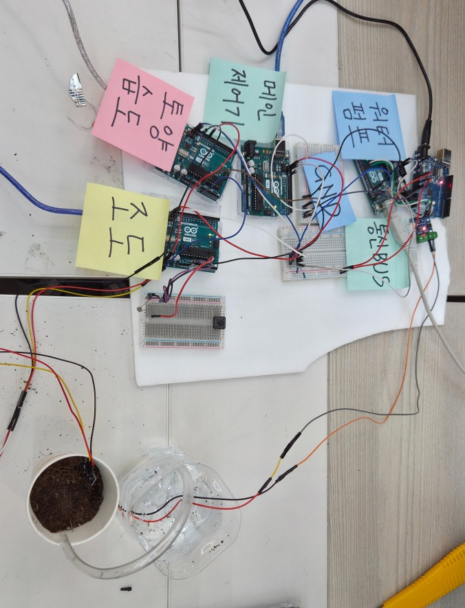

# 설계와 구현

## 데이터 흐름

조도와 토양수분 노드는 각자의 ADC로 A0 입력을 읽습니다. 두 노드가 중앙 제어기에 측정 결과를 보내면, 제어기는 주간 여부와 수분 기준을 함께 판단합니다. 관수 조건을 만족할 때 관수 노드에 PWM 명령을 보내고, 이후 토양수분 피드백으로 다음 명령값을 갱신합니다.



## 노드와 하드웨어 자원

| 노드 | 주소 | 입력·출력 | 사용하는 주변장치 |
|---|---|---|---|
| 토양수분 | `0x20` | A0: Grove 센서 출력, D11: 원 코드의 측정 표시 신호 | ADC, Timer2, TWI, UART |
| 조도 | `0x28` | A0: CdS 분압 회로 | ADC, Timer2, TWI, UART |
| 중앙 제어기 | `0x25` | 센서값 수신, PWM 명령 송신 | Timer2, TWI, UART |
| 관수 | `0x21` | D6: PWM, D5: LOW, L9110S를 통한 펌프 구동 | Timer0, Timer2, TWI, UART |

- MCU 클럭: 16 MHz
- TWI 버스: 100 kHz, `TWBR = 72`, prescaler 1
- ADC: AVcc 기준전압, 분주비 128, 125 kHz ADC 클럭
- UART: 9,600 bps, 8N1, `UBRR = 103`
- 펌프 PWM: Timer0 Fast PWM, 분주비 64, 약 976.6 Hz

## I²C 프로토콜

네 노드는 공통 SDA·SCL 버스를 사용합니다. 센서와 제어기는 전송이 필요할 때 START를 발생시켜 마스터로 동작하며, 중앙 제어기와 관수 노드는 자신의 주소로 들어오는 데이터를 수신합니다.

| 단계 | 값 |
|---|---|
| 주소 단계 | 목적지 7비트 주소 + Write 비트 |
| 데이터 1 | 송신 노드 ID |
| 데이터 2 | 측정값 또는 PWM 명령 |
| 종료 | STOP |

| 송신 → 수신 | 페이로드 예시 | 의미 |
|---|---|---|
| 토양수분 → 제어기 | `[0x20, 30]` | 수분 지표 30 |
| 조도 → 제어기 | `[0x28, 0]` | 주간 |
| 조도 → 제어기 | `[0x28, 1]` | 야간 |
| 제어기 → 관수 | `[0x25, 150]` | PWM 명령 150 |

TWI 상태 레지스터의 상위 5비트로 START, 주소 ACK, 데이터 ACK, NACK, 중재 상실을 판별합니다. 현재 소스는 두 바이트를 모두 수신하고 STOP 또는 repeated START를 받았을 때 프레임을 반영합니다. 추가 바이트나 허용 범위를 벗어난 값은 반영하지 않습니다.

## 시간 관리

Timer2를 Normal mode, 분주비 1024로 설정하면 오버플로우 간격은 다음과 같습니다.

```text
256 × 1024 / 16,000,000 = 0.016384 s
```

| 동작 | 오버플로우 횟수 | 계산상 간격 |
|---|---:|---:|
| 센서 전송 | 183 (`61 × 3`) | 약 2.998초 |
| 관수 판단 | 915 (`61 × 15`) | 약 14.991초 |
| 관수 시작 후 보정 | 305 (`61 × 5`) | 약 4.997초 |
| 펌프 구동 | 183 | 약 2.998초 |

위 값은 타이머 기준입니다. 센서 노드는 측정·전송 처리를 마친 뒤 카운터를 초기화하므로 실제 전송 간격에는 해당 처리 시간이 더해집니다.

관수 판단과 보정에는 `현재 카운트 - 시작 카운트 >= 간격` 조건을 사용합니다. 보정 대기 플래그로 관수 한 번에 보정 한 번만 수행하며, 전송 실패 시에는 보정을 예약하지 않습니다. 펌프는 별도 노드의 타이머 인터럽트로 종료합니다.

## 수분 지표와 기준값

토양수분 노드가 전송하는 값은 Grove 센서의 ADC 출력을 정규화한 **0~100 수분 지표**입니다.

```text
soil_index = min(100, floor(100 × ADC / 660))
```

배양토의 포장용수량(FC), 영구위조점(PWP), 상추의 허용 고갈률(p)을 참고해 제어 기준을 정했습니다. 채택한 수치와 계산은 다음과 같습니다.

| 항목 | 채택한 값·계산 |
|---|---|
| FC | 47.8% |
| PWP | 14.7% |
| TAW | `47.8 - 14.7 = 33.1` percentage points |
| p | 0.3 |
| RAW | `0.3 × 33.1 = 9.93` percentage points |
| 관수 시작 기준 | `47.8 - 9.93 = 37.87` |

펌웨어는 이 수치에서 목표값 **47.8**, 관수 시작 기준 **37.87**을 설정하고, 센서가 보내는 수분 지표와 비교합니다. 다른 센서·흙으로 구성할 때는 같은 흙에서 측정한 건조·습윤 기준에 맞춰 변환식과 제어 기준을 설정합니다.

## PWM 갱신

관수 시작 약 5초 후 토양수분 지표 `s`로 다음 출력을 계산합니다.

```text
e = 47.8 - s
k = 0.40 if e > 0 else 0.80
u_next = clamp(u + k × e, 0, 254)
```

| 현재 PWM | 관수 후 수분 지표 | 오차 | 다음 PWM |
|---:|---:|---:|---:|
| 150 | 30 | +17.8 | 157.12 |
| 150 | 70 | −22.2 | 132.24 |

제어기는 계산값을 실수로 유지하고, 전송할 때 정수 바이트로 변환합니다. 목표보다 습한 경우에는 더 큰 이득으로 다음 관수 출력을 낮춥니다.

## 조도 판정

- ADC가 500 미만이면 야간, 800 초과이면 주간으로 판단합니다.
- 직전 측정값과의 차이가 300을 넘으면 700을 기준으로 전환 방향을 결정합니다.
- 그 사이에서는 직전 판정을 유지합니다. 첫 측정은 700을 기준으로 초기화합니다.

## 참고 문헌

- Schindler, Lischeid, Müller, *Hydraulic Performance of Horticultural Substrates—3. Impact of Substrate Composition and Ingredients* (2016).
- Allen et al., *Crop evapotranspiration: Guidelines for computing crop water requirements*, FAO Irrigation and Drainage Paper 56 (1998).
